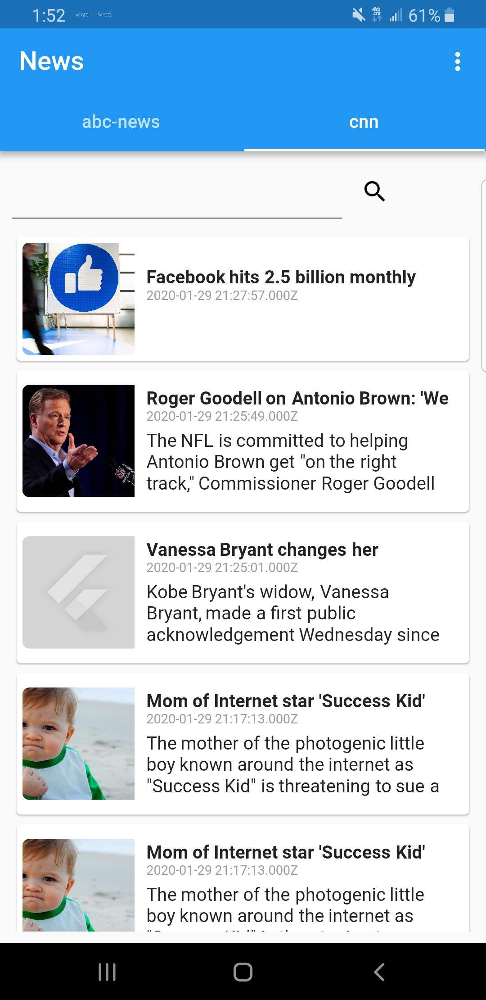

# News App

News app showing implementation of HTTP request, parsing JSON data and dynamic tabs. 

# First Step
Make sure to register at **https://newsapi.org/v2** to get your free license key. Copy and paste to assign it to variable **_apiKey** in following code below.

📄 lib/services/NewsApi.dart

    class NewsApi
    {
      final String _baseUrl = "https://newsapi.org/v2";
    
      final String _apiKey = "";
     .
     .
    }

	
## Flutter Resources

For help getting started with Flutter, view our
[online documentation](https://flutter.dev/docs), which offers tutorials,
samples, guidance on mobile development, and a full API reference.
